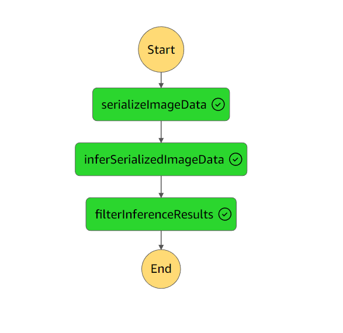
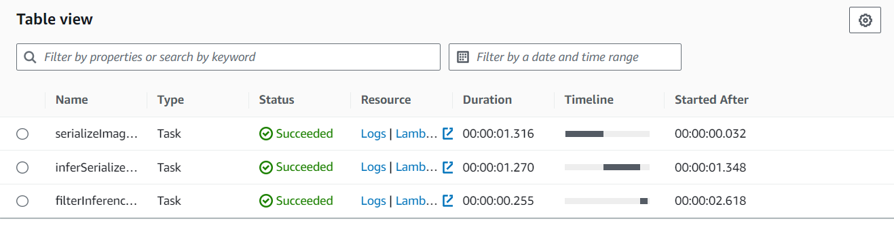

# AWS SageMaker ML Pipeline: Vehicle Classification System for Scones Unlimited

Welcome to my comprehensive machine learning project! I've developed an intelligent image classification system that automatically identifies delivery vehicles (bicycles vs motorcycles) to optimize Scones Unlimited's delivery operations. This end-to-end solution leverages AWS cloud services including SageMaker, Lambda, and Step Functions to create a production-ready ML workflow that enhances logistics efficiency and customer satisfaction. 🚀🤖

## Quick Start Guide

* Begin your journey by opening the [main project notebook](SconesUnlimited.ipynb).

### System Requirements

```
Python 3.8
scikit-learn latest
```


### Environment Setup
I strongly recommend using SageMaker Studio from the provided AWS workspace for optimal performance and seamless integration.

For local development enthusiasts, you'll need to configure a Jupyter Lab environment:
* Visit the [official Jupyter installation guide](https://jupyter.org/install.html) for detailed setup instructions.
* If you already have a Python virtual environment, simply install Jupyter Lab:
```
pip install jupyterlab
```


## Project Summary 📊

I've architected and deployed a robust image classification pipeline using Amazon SageMaker's powerful ML capabilities. The primary objective was to develop an intelligent system that can accurately differentiate between bicycles and motorcycles, enabling Scones Unlimited to automatically assign delivery professionals to appropriate orders based on vehicle type. The implementation follows a systematic approach:

### Phase 1: Data Engineering & Preparation 📁

- Configured and launched SageMaker Studio workspace.
- Engineered comprehensive data preprocessing pipeline.
- Validated data quality and readiness for model training.

### Phase 2: ML Model Development & Deployment 🚀

- Trained a sophisticated image classification model using SageMaker.
- Successfully deployed the trained model as a production-ready API endpoint.
- Established secure API connectivity for real-time inference.

### Phase 3: Serverless Architecture & Workflow Orchestration ⚙️

- Designed and implemented three specialized Lambda functions:
  1. Image data extraction and serialization service.
  2. Real-time image classification engine.
  3. Confidence-based inference filtering system.
- Engineered a sophisticated Step Function workflow to coordinate all Lambda operations seamlessly.

### Phase 4: Performance Validation & Quality Assurance 🧪

- Conducted comprehensive testing and evaluation of the ML pipeline.
- Achieved and maintained classification accuracy exceeding **94%** on test datasets.

### Phase 5: Resource Optimization & Cleanup ♻️

- Implemented systematic cleanup procedures for cloud resources.

## Technical Expertise Demonstrated 🧠

This project showcases my proficiency in:

- SageMaker Studio environment configuration and optimization.
- Advanced ML model training and deployment strategies.
- AWS Lambda function development and management.
- Step Functions workflow design and implementation.
- SageMaker Model Monitor integration for performance tracking.
- Data visualization and analytical interpretation.

----
## Lambda Function Architecture

1. **Image Serialization Service**: Processes S3-hosted images and converts them to JSON format for downstream processing.
2. **Classification Engine**: Executes real-time inference using the deployed SageMaker endpoint and returns structured results.
3. **Quality Control Filter**: Implements confidence threshold filtering to ensure only high-quality predictions proceed to production systems.

## Workflow Visualization

### Step Functions Execution Graph


### Step Function Execution Details
